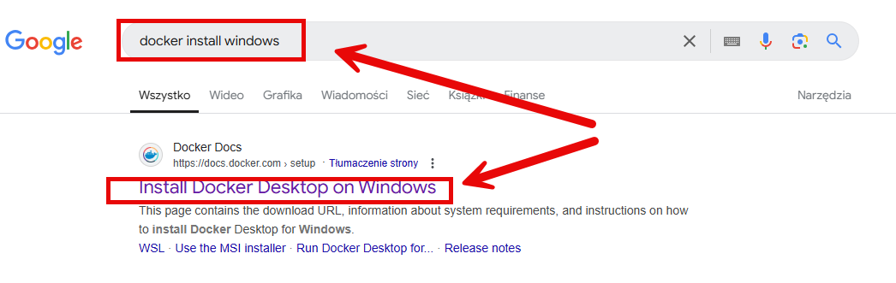
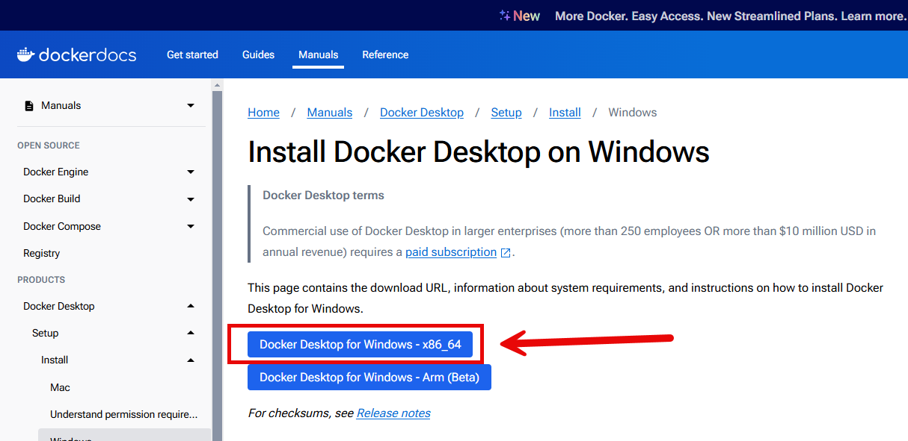
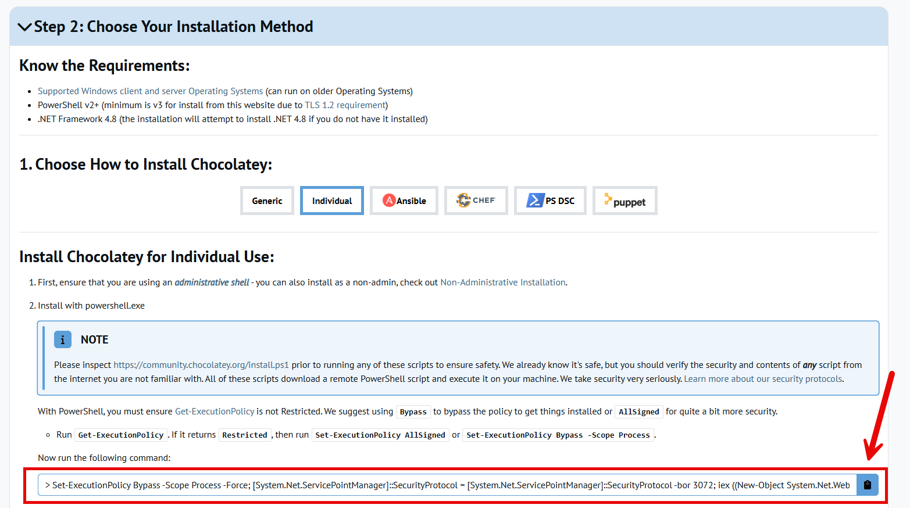
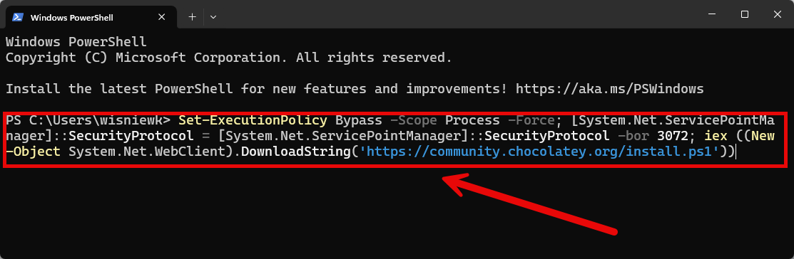
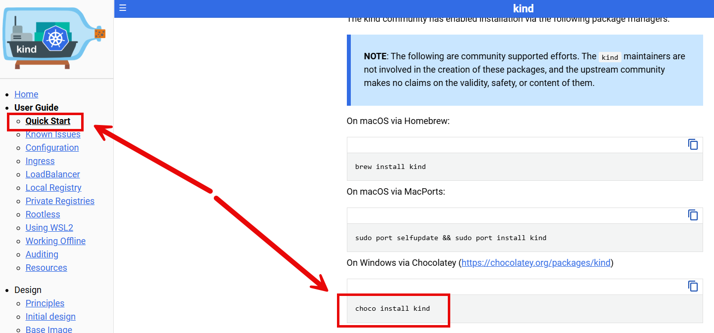
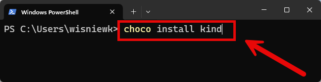

DESCRIPTION
-----------

##### Goal
The goal of this project is to present how to install **Kind** tool. Kind (short for Kubernetes IN Docker) is a tool used to run Kubernetes clusters locally using Docker containers.

INSTALLATION ON WINDOWS
-----------------------

To install Kind on Windows OS please proceed with following steps:

**1. Install Docker**

**2. Install Chocolatey**

**3. Install Kind**

TESTING
-------

To test if Kind is properly installed please proceed with following steps:
1. Start **Docker** tool
1. Open any **command line tool** in **administration mode**
1. Start Kubernetes cluster with `kind create cluster`
1. Remove Kubernetes cluster with `kind delete cluster`