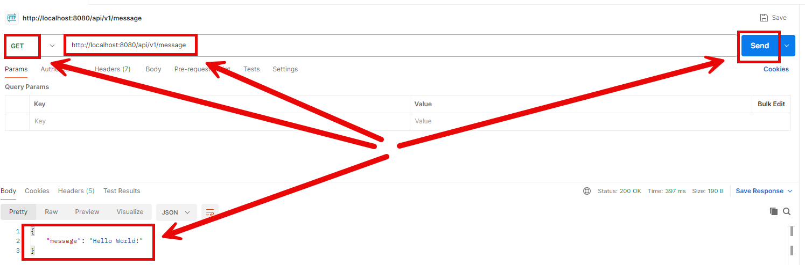

EXAMPLE
-------




DESCRIPTION
-----------

##### Goal
The goal of this project is to present how to implement **docker-compose-wait** library between two **REST API** applications with usage **Java** programming language and **Spring Boot 3** framework. Library docker-compose-wait pauses building one docker container until second docker container is fully working. In this example appliation "first" is paused until application "second" is run successfully.

##### Elements
This project consists of following elements:
* **First**: Rest API application
   * Input: endpoint "api/vi/message"
   * Content: RestClient communication with second application
   * Output: JSON with message
* **Second**: Rest API application
   * Input: endpoint "api/vi/message"
   * Content: N/A
   * Output: JSON with message

##### Terminology
Terminology explanation:
* **Git**: Git is a distributed version control system (VCS) that tracks changes in code, allowing multiple developers to collaborate efficiently. It helps manage different versions of a project, enabling branching, merging, and rollback to previous states.
* **Maven**: Maven is a build automation and project management tool for Java-based projects, used primarily for dependency management and project configuration.
* **Java**: Java is a high-level, object-oriented programming language known for its platform independence, achieved through the Java Virtual Machine (JVM). It is widely used for web, mobile, and enterprise applications. Java follows the "write once, run anywhere" (WORA) principle, making it a popular choice for cross-platform development.
* **Spring Boot**: Spring Boot is a Java-based framework that simplifies the development of stand-alone, production-ready Spring applications by providing auto-configuration, embedded servers, and a convention-over-configuration approach.
* **REST API**: A REST API (Representational State Transfer API) is a web service that allows systems to communicate over HTTP using standard methods like GET, POST, PUT, and DELETE. It follows REST principles, ensuring scalability, statelessness, and resource-based interactions, typically using JSON or XML for data exchange.
* **docker-compose-wait**: docker-compose-wait is a small utility that makes a container wait for dependencies (e.g., databases, services) to be ready before starting its main process. It is commonly used in docker-compose setups to ensure that services start in the correct order.


USAGES
------

This project can be tested in following configurations:
* **Usage Docker Compose**: all services are started as Docker containers definied in docker compose file.


USAGE DOCKER COMPOSE
--------------------

> **Usage Docker Compse** means all services are started as Docker containers definied in docker compose file.

> Please **clone/download** project, open **project's main folder** in your favorite **command line tool** and then **proceed with steps below**.

> **Prerequisites**:  
* **Operating System** (tested on Windows 11)
* **Git** (tested on version 2.33.0.windows.2)
* **Docker** (tested on version 4.33.1)

##### Required steps:
1. Start **Docker** tool
1. In a command line tool **start Docker containers** with `docker-compose up -d --build`
1. In any REST Client (e.g. Postman) visit **first** application with `http://localhost:8080/api/v1/message`
   * Expected JSON with "Hello World!" message
1. Clean up environment 
     * In a command line tool **remove Docker containers** with `docker-compose down --rmi all`
     * Stop **Docker** tool

##### Optional steps:
1. In a command line tool validate Docker Compose with `docker-compose config`
1. In a command line tool check list of Docker images with `docker images`
1. In a command line tool check list of all Docker containers with `docker ps -a`
1. In a command line tool check list of active Docker containers with `docker ps`
1. In a command line tool check list of Docker nerworks with `docker network ls`
1. In a command line tool check container logs with `docker logs {container-name}`


IMPLEMENTATION
--------------

Implementation details:
* In **Dockerfile** add following fragment:
```
COPY --from=ghcr.io/ufoscout/docker-compose-wait:latest /wait /wait
ENTRYPOINT ["/bin/sh", "-c", "/wait && java -jar /opt/app/*.jar"]
```
* In **docker-compose.yaml** add environment variable **WAIT_HOSTS** (and optionally **WAIT_TIMEOUT**)