EXAMPLE
-------

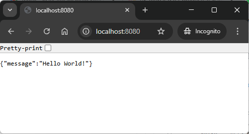

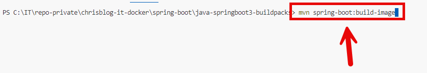

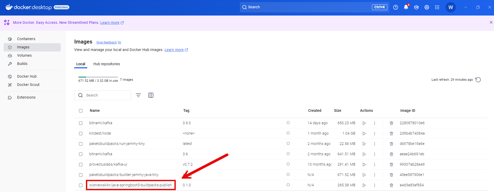

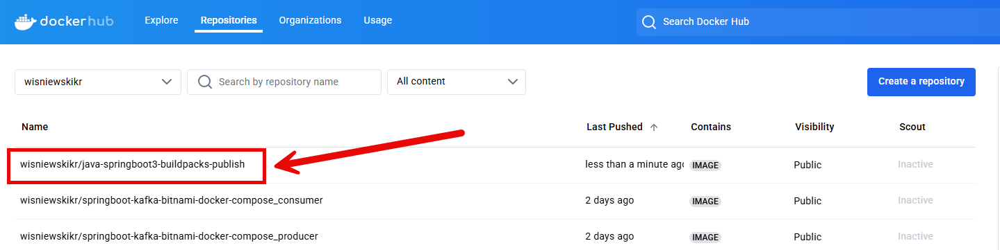

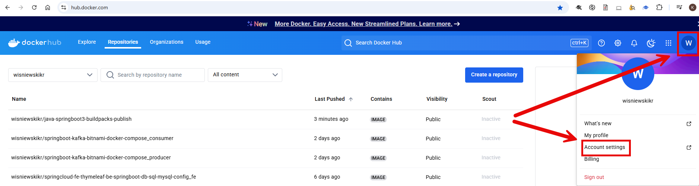

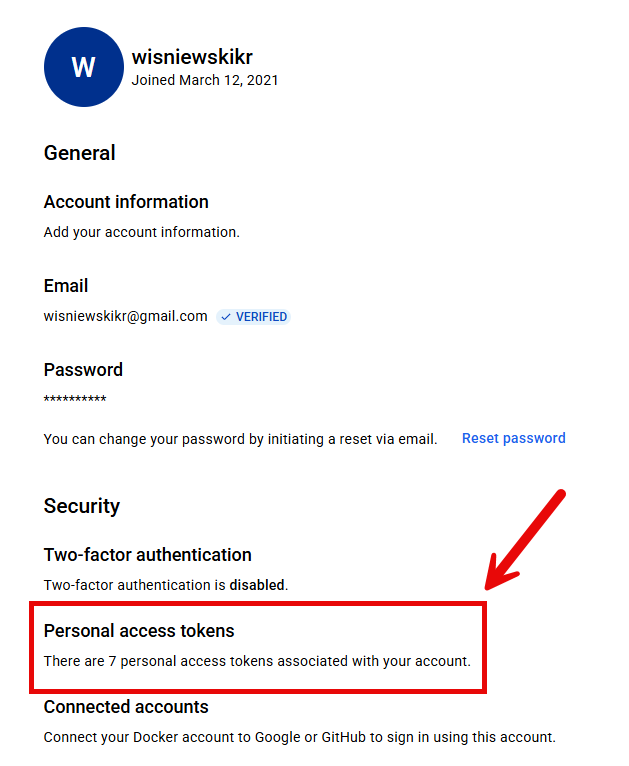

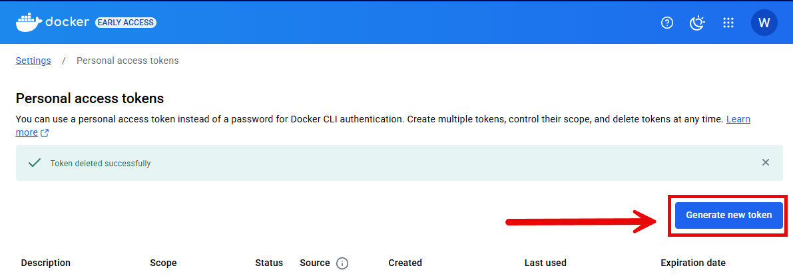

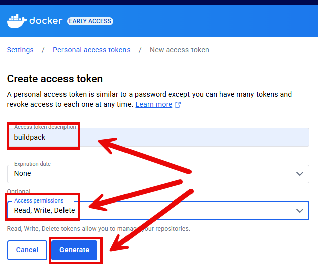

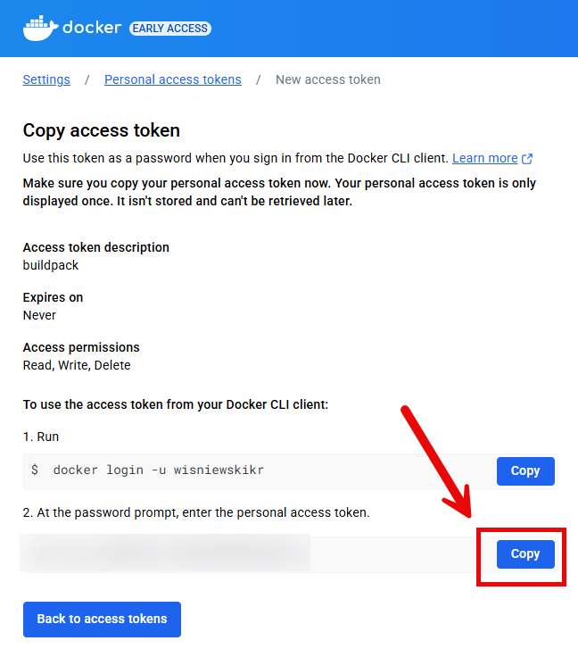

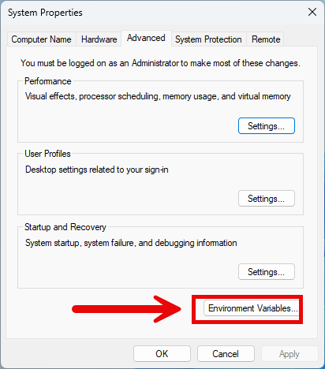

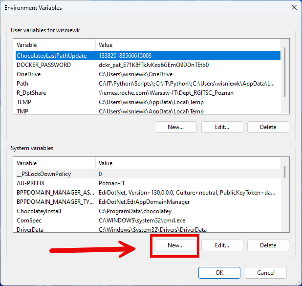

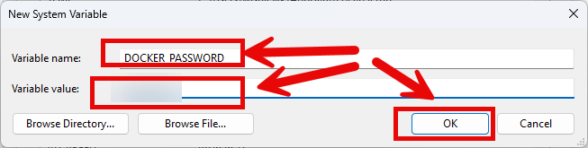

DESCRIPTION
-----------

##### Goal
The goal of this project is to present how to create and **publish** to Docker Hub a Docker image af an application using **build packs** in **Java** programming language with usage **Spring Boot 3** framework.

##### Terminology
Terminology explanation:
* **Git**: Git is a distributed version control system used to track changes in code, collaborate with others, and manage source code history efficiently.
* **Java**: Java is a high-level, object-oriented programming language known for its platform independence, achieved through the Java Virtual Machine (JVM). It is widely used for developing web, mobile, desktop, and enterprise applications, emphasizing simplicity, security, and portability. "Write once, run anywhere" is its core principle.
* **Maven**: Maven is a build automation and dependency management tool for Java projects, streamlining project builds, managing libraries, and ensuring consistent project configurations.
* **Spring Boot**: Spring Boot is a framework for building Java-based applications that simplifies development by providing auto-configuration, embedded servers, and production-ready tools, enabling developers to create standalone, production-ready applications with minimal configuration.
* **Build Packs**: A buildpack is a set of scripts used in platform-as-a-service (PaaS) environments, like Heroku or Cloud Foundry, to automate the process of detecting, building, and configuring applications. Buildpacks identify the language or framework of an app, install necessary dependencies, and prepare the app for deployment.

USAGE
-----

> Please **clone/download** project, open **project's main folder** in your favorite **command line tool** and then **proceed with steps below**.

> **Prerequisites**:  
* **Operating System** (tested on Windows 11)
* **Git** (tested on version 2.33.0.windows.2)
* **Docker** (tested on version 4.33.1)  

Usage steps:
1. Start **Docker** tool
1. In a command line tool **build Docker image** with `mvn spring-boot:build-image`
1. Open **Docker Desktop**
   * Exapected **Docker image** with name **wisniewskikr/java-springboot3-buildpacks-publish:0.1.0**
1. Open **Docker Hub** with `https://hub.docker.com/`
   * Exapected **Docker image** with name **wisniewskikr/java-springboot3-buildpacks-publish:0.1.0**
1. Clean up environment 
     * Stop **Docker** tool

IMPLEMENTATION
--------------

Implementation steps:
1. Update **pom.xml** file with plugin **spring-boot-maven-plugin** with configuration
   * Attribute **name** as **wisniewskikr/${project.artifactId}:${project.version}**
   * Attriubute **publish** as **true**
   * Attribute **publishRegistry/username** as **Docker Hub username**
   * Attribute **publishRegistry/username** as **Docker Hub password**
1. Save **Docker Password** as **environment variable** with value **DOCKER_PASSWORD**
1. Update **pom.xml** with property **<docker.password>${env.DOCKER_PASSWORD}</docker.password>**