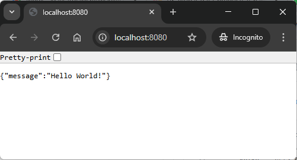

EXAMPLE
-------

DESCRIPTION
-----------

##### Goal
The goal of this project is to present how to create Docker image af an application using **build packs** in **Java** programming language with usage **Spring Boot 3** framework.

##### Terminology
Terminology explanation:
* **Git**: Git is a distributed version control system used to track changes in code, collaborate with others, and manage source code history efficiently.
* **Java**: Java is a high-level, object-oriented programming language known for its platform independence, achieved through the Java Virtual Machine (JVM). It is widely used for developing web, mobile, desktop, and enterprise applications, emphasizing simplicity, security, and portability. "Write once, run anywhere" is its core principle.
* **Maven**: Maven is a build automation and dependency management tool for Java projects, streamlining project builds, managing libraries, and ensuring consistent project configurations.
* **Spring Boot**: Spring Boot is a framework for building Java-based applications that simplifies development by providing auto-configuration, embedded servers, and production-ready tools, enabling developers to create standalone, production-ready applications with minimal configuration.

USAGE
-----

> Please be aware that following tools should be installed on your local PC: **Java**, **Maven** and **Git**. 

> Please **clone/download** project, open **project's main folder** in your favorite **command line tool** and then **proceed with steps below**. 

Usage steps:
1. In a command line tool start application with `mvn spring-boot:run`
1. In a browser visit `http://localhost:8080`
   * Expected JSON **{"message":"Hello World!"}**
1. Clean up environment 
     * In a command line tool stop application with `ctrl + C`

USAGE DOCKER
--------------

> Please be aware that following tools should be installed in advance on your computer: **Docker**. Docker tool has to be **up and running**. 

> Please **clone/download** project, open **project's main folder** in your favorite **command line tool** and then **proceed with steps below**. 

Usage steps:
1. In a command line tool build Docker image with `docker build -t java-springboot3-api-rest-helloworld-image .`
1. (Optional) In a command line tool check list of all images with `docker images`
   * Expected **list of all docker images** downloaded on a computer
1. In a command line tool start Docker container with `docker run -d -p 8080:8080 --name java-springboot3-api-rest-helloworld-container java-springboot3-api-rest-helloworld-image`
1. (Optional) In a command line tool check list of all containers with `docker ps -a`
   * Expected **list of all docker containers** installed on a computer
1. In a http browser (e.g. Chrome) visit `http://localhost:8080`
   * Expected JSON **{"message": "Hello World!"}**
1. (Optional) In a command line tool check application logs with `docker logs java-springboot3-api-rest-helloworld-container`
   * Expected **application logs**
1. Clean up environment 
     * In a command line tool stop and remove Docker container with `docker rm -f java-springboot3-api-rest-helloworld-container`
     * In a command line tool stop and remove Docker image with `docker rmi java-springboot3-api-rest-helloworld-image`